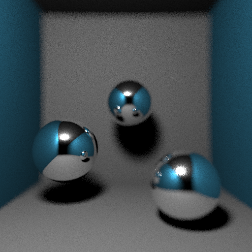
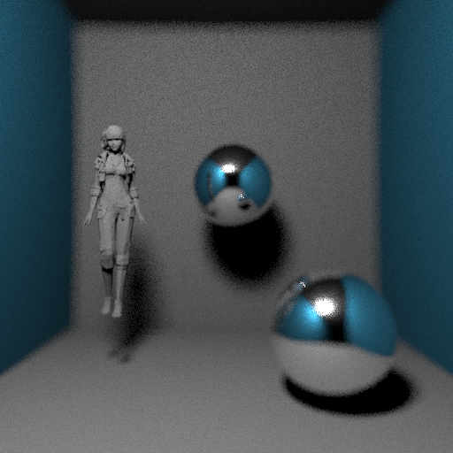
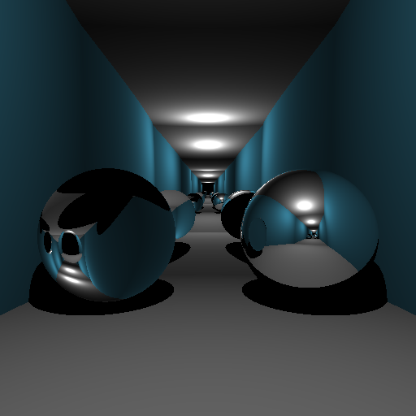

# RayTracer

#### In 3D computer graphics, ray tracing is a rendering technique for generating an image by tracing the path of light as pixels in an image plane and simulating the effects of its encounters with virtual objects. The technique is capable of producing a high degree of visual realism, more so than typical scanline rendering methods, but at a greater computational cost.

##### This repo has been built from scratch in C without any use of external package and is able to exploit multi-processing.

  
  
  

